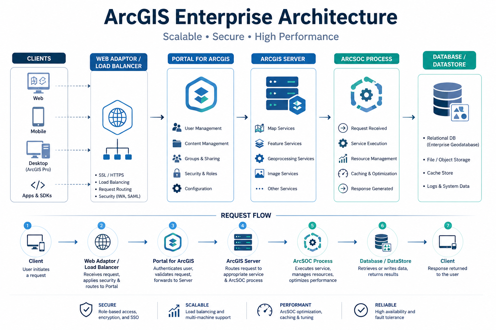

# ArcGIS Enterprise Performance Cheatsheet

> This is just a a checklist, for more explanation feel free to check the official blog post. 

---

## Define the Scope First

```
Is it one service?     → Check service status, type, queue length
Is it one machine?     → Check OS resources and network health
Is it all machines?    → Check database, datastore, network path
Were there changes?    → Review new services, updates, data changes
```

---

## Request Flow (Where Is Time Being Spent?)



```
Client
  ↓
Web Adaptor / Load Balancer
  ↓
Portal for ArcGIS        ← Authentication bottlenecks
  ↓
ArcGIS Server            ← Service execution delays
  ↓
ArcSOC Process           ← CPU and memory consumption
  ↓
Database / DataStore     ← Query latency (most common root cause)
```

> ⚠️ Most "ArcGIS is slow" issues are actually **database problems wearing a GIS mask**. Check the data tier first.

---

## ⚡ Symptom → Likely Cause → Fix

### Slow Map Services During Peak Hours

```
Cause   → Insufficient ArcSOC instances / database contention / uncached layers
Fix     → Increase max instances (if RAM allows)
          Enable tile caching for base layers
          Optimize database indexes
```

### ArcSOC Consuming Excessive Memory

```
Cause   → Memory leak in custom code / oversized pools
Fix     → Set service recycling (recycle after N requests)
          Reduce max instances
          Review ArcGIS version for known memory issues
```

### Portal Feels Slow but Services Are Fast

```
Cause   → Heap too small / search index issues / IdP latency
Fix     → Check Portal logs for GC or OOM errors
          Increase JVM heap size
          Investigate identity provider response time
```

### Geoprocessing Service Timeouts

```
Cause   → Timeout too short / pooled service with long-running tasks
Fix     → Increase Web Adaptor ProxyTimeout
          Increase Server RequestTimeout
          Set service to non-pooled (Min=0, Max=0)
```

---

## 🔧 ArcSOC — Quick Settings Reference

| Setting | What It Does | Too Low | Too High |
|---|---|---|---|
| Min Instances | Pre-loaded processes | Cold-start delays | Wasted memory at idle |
| Max Instances | Concurrent execution limit | Requests queue up | Resource contention / thrashing |
| Max Wait | How long client waits in queue | Fast failures | Users wait too long |
| Max Duration | How long client holds an ArcSOC | Jobs time out early | ArcSOC tied up too long |
| maxRecordCount | Records returned per query | Truncated results | Large payloads, slow response |

**Where to change:**
- Manager → Services → Select Service → Pooling
- Admin Directory → Services → Select Service → Edit → `minInstancesPerNode` / `maxInstancesPerNode`

> ⚠️ Restart the service after changing pooling values. Do this during off-peak hours.

---

## 💾 Memory — Quick Diagnosis

| Symptom | Likely Cause |
|---|---|
| High CPU, low memory | Compute bottleneck |
| Low CPU, high memory | Memory pressure |
| High disk activity, low CPU | Paging / swapping |
| Intermittent crashes | Memory exhaustion |
| Steady ArcSOC memory growth | Memory leak |

**Formula:**
```
Services × ArcSOC Instances × Avg Memory per ArcSOC = Total Memory Used
```

**Signs of memory pressure:**
```
✔ Gradually increasing response times
✔ Unexpected ArcSOC recycling or crashes
✔ OS swapping / high page file usage
✔ OutOfMemoryError in logs
```

---

## ☕ Heap Size — Quick Reference

| RAM | Recommended Heap |
|---|---|
| 8 GB (test/dev) | 2–3 GB |
| 16 GB (100 users) | 6–8 GB |
| 32 GB (500+ users) | 12–16 GB |

**Symptoms of wrong heap size:**

```
Too Small                        Too Large
─────────────────────────────    ──────────────────────────────
Slow Portal pages                Long GC pauses (freezes UI)
Frequent garbage collection      Increased memory fragmentation
Authentication delays            Slow recovery after peak usage
OutOfMemoryError in logs
```

**Rules:**
```
✔ Set Xms = Xmx (avoid runtime heap resizing)
✔ Leave RAM headroom for the OS and other processes
✔ Never increase blindly — tune based on GC logs and OOM errors
```

**Where to change heap (ArcGIS Server):**
- Server-level: Admin Directory → Machines → Select Machine → Edit → SOC Maximum Heap Size
- Service-level: Manager → Services → Select Service → Processes

---

## 📊 Key Metrics to Watch

```
Response Time     → avg, 95th percentile, max
Throughput        → requests per second
Error Rate        → % of failed requests
Busy Instances    → if = max, requests are queuing
Queue Length      → > 0 for extended time = capacity problem
ArcSOC Lifetime   → very short = crashes or memory leaks
Memory per ArcSOC → watch trends, not snapshots
CPU per ArcSOC    → identify resource hogs
```

**OS-level:**
```
Memory    → used / available / swap
CPU       → total and per-core
Disk I/O  → read/write wait time (paging?)
Network   → bandwidth / latency / packet loss
```

---

## 🛠️ Monitoring Tools

| Tool | Use For |
|---|---|
| ArcGIS Server Manager | Service status, basic stats, logs |
| Server Statistics REST API | Programmatic service metrics |
| ArcGIS Monitor | Centralized stack view — correlate service + OS + DB |
| ArcGIS Logs | Set to INFO or FINE during troubleshooting only |
| btop / htop / vmstat | Linux OS metrics |
| Performance Monitor | Windows OS metrics |
| pg_stat / AWR / Activity Monitor | Database query performance |

---

## 📋 Investigation Workflow

```
1. Define scope         → one service? one machine? all machines?
2. Measure first        → CPU, memory, queue length, response time, logs
3. Find the bottleneck  → Portal? Server? Database? Network? Storage?
4. Change one thing     → never adjust heap + pooling + DB at the same time
5. Measure again        → compare against baseline
```

---

## ✅ Operational Runbook

### Daily
```
□ All services healthy in Server Manager
□ Review last 24h error logs
□ Memory usage < 70%
□ CPU usage < 80%
□ Disk usage < 80%
```

### Weekly
```
□ Review response-time trends
□ Check queue length per service
□ Review GC logs for Java components
□ Verify backups completed
```

### Before / After Changes
```
Before                          After
──────────────────────────────  ──────────────────────────────
Record performance baseline     Test all services
Back up all environments        Compare metrics to baseline
Test in non-prod first          Review logs for new errors
                                Monitor closely for several days
```

---

## 🏃 Quick Triage Checklist

```
□ Gather evidence first — screenshots, logs, performance data
□ Is it one service?    → service status, type, queue length
□ Is it one machine?    → OS resources, network
□ Is it all machines?   → database, datastore, network path
□ Recent changes?       → new services, updates, data changes
□ Act                   → adjust pools, restart services, optimize queries
```

---

## 📎 Related

- [Performance Deep Dive](../docs/Performance-Deep-Dive.md)
- [ArcSOC Processes Guide](../docs/ArcSOC-Processes.md)
- [Memory Optimization and Heap Sizing](../docs/Memory-Optimization-and-Heap-Sizing.md)
- [Esri — Configure service instance settings](https://enterprise.arcgis.com/en/server/latest/administer/windows/configure-service-instance-settings.htm)
- [Esri — Tune services to meet user needs](https://enterprise.arcgis.com/en/server/latest/administer/windows/tune-and-configure-services.htm)
- [ArcGIS Monitor](https://www.esri.com/en-us/arcgis/products/arcgis-monitor/overview)
- [ArcGIS Online Health Dashboard](https://status.arcgis.com/)

---

*Based on: ArcGIS Enterprise 12.0 · Field-tested troubleshooting scenarios*
